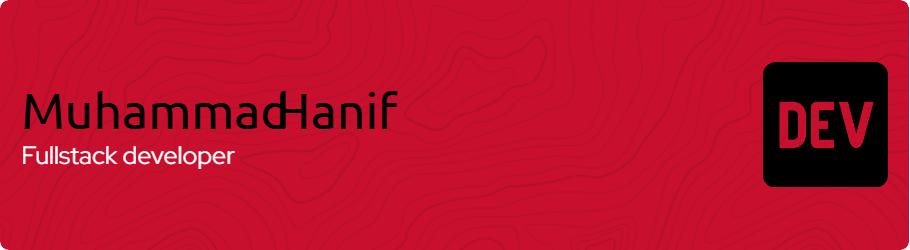

### 🏴‍☠️ Ahoy! I'm Hanif 👋

⛵ I'm a web developer and **One Piece fanatic** sailing through the Grand Line of code.  
My passion for programming is as strong as Luffy's will to become the Pirate King! 🏴‍☠️

---

### 🛠️ What I Code With

          

---

### 🔥 My Pirate Vibes
- 🧠 Always learning like Robin  
- ⚔️ Coding with focus like Zoro  
- 😎 Chill like Brook, but serious when it's time to deploy  
- 🚀 I believe **"No Bug, No Life"** – unless it's Chopper 🐾

---

### 📫 Join My Crew (Contact Me)
- 📧 hanifpku30@gmail.com
- 🌍 [Website/Portfolio Coming Soon...]

---

> _"If you don’t take risks, you can’t create a future."_ – Monkey D. Luffy  
> _Let's sail together and build awesome stuff!_

###
<picture>
  <source media="(prefers-color-scheme: dark)" srcset="https://raw.githubusercontent.com/maurodesouza/maurodesouza/output/pacman-contribution-graph-dark.svg">
  <source media="(prefers-color-scheme: light)" srcset="https://raw.githubusercontent.com/maurodesouza/maurodesouza/output/pacman-contribution-graph.svg">
  
</picture>
