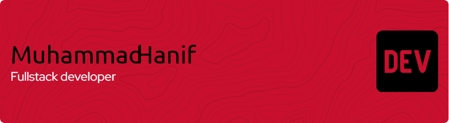

# Ahoy, aku Hanif! 👋

## 👨‍💻 Tentang Aku

Fullstack developer yang suka ngerjain aplikasi dari ujung ke ujung: mulai dari desain di Figma, logika di sisi server, sampai database-nya. Targetku simpel: aplikasi yang stabil, gampang dikembangkan, dan enak dipakai.

Buatku, ngoding itu mirip berlayar di Grand Line. Rutenya sering nggak jelas, kadang nyasar gara-gara bug, tapi di tiap pulau selalu ada hal baru yang bisa dipelajari.

## 🛠️ Tech Stack

**Bahasa Pemrograman** 

**Database** 

**Desain & Tools** 

## 🏴‍☠️ Cara Kerjaku

Versi Bajak Laut Topi Jerami:

- 🧠 **Penasaran terus.** Kayak Robin yang nggak berhenti nyari Poneglyph, aku suka ngulik teknologi baru supaya skill-ku nggak jalan di tempat.
- ⚔️ **Fokus dan presisi.** Aku suka kode yang bersih, efisien, dan gampang dirawat, soalnya yang bakal baca ulang nanti ya aku juga. Tiap masalah kutebas satu per satu, serapi Zoro.
- 🤝 **Tetap tenang pas deadline mepet.** Tim yang santai kerjanya lebih enak, jadi aku coba jaga suasana tetap positif. Vibes-nya ala Brook.
- 🐛 **Nggak ada bug yang kebal.** Edge case kuburu sampai sistemnya jalan mulus. Kecuali bug-nya Chopper, yang itu dimaafkan 🐾

## 📫 Yuk, Ngobrol

Terbuka buat kolaborasi proyek open source, diskusi soal arsitektur software, atau sekadar debat chapter One Piece terbaru. Kirim aja pesannya lewat email.

🌍 **Portofolio:** segera berlayar ⛵

> *"Kalau nggak berani ambil risiko, kamu nggak bisa menciptakan masa depan."*  
> — **Monkey D. Luffy**

  <picture>
    <source media="(prefers-color-scheme: dark)" srcset="https://raw.githubusercontent.com/Hanif-ID/Hanif-ID/output/pacman-contribution-graph-dark.svg">
    <source media="(prefers-color-scheme: light)" srcset="https://raw.githubusercontent.com/Hanif-ID/Hanif-ID/output/pacman-contribution-graph.svg">
    
  </picture>

